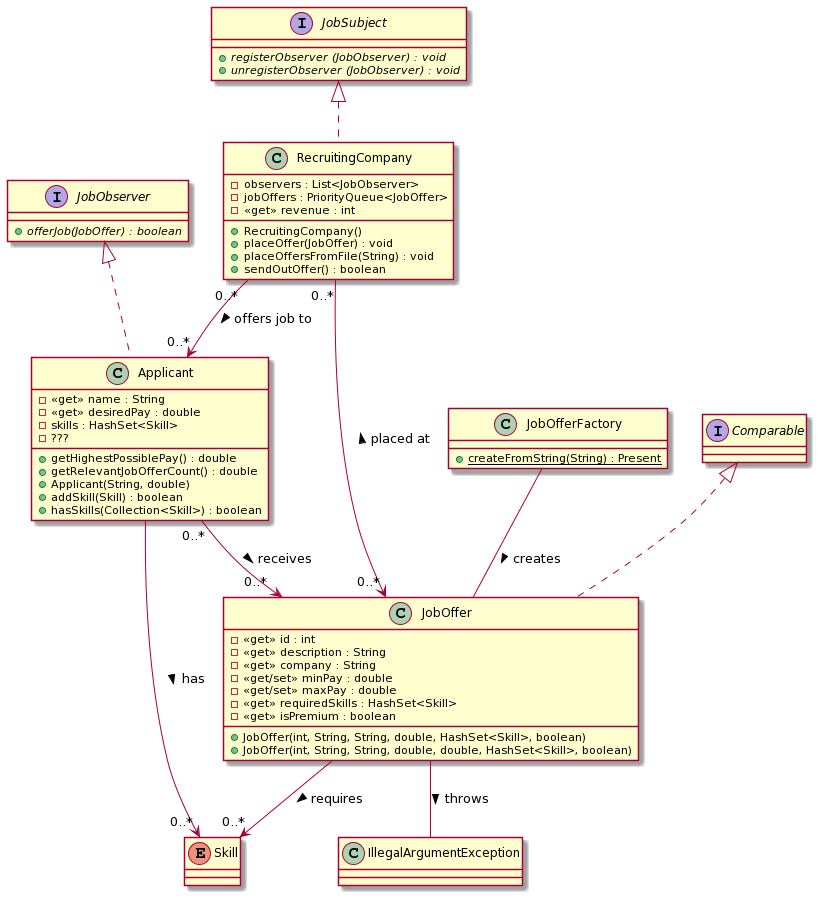

# PROO 3 - Assignment: Recruiting Company

## Objective
Simulate a recruiting company contacting possible applicants using the _Observer pattern_.

## Things To Learn
* Introduction to Maven: Using a _Maven_ project.
* Implementing the _Observer_ and _Factory_ patterns.
* Importing, configuring and logging with _Log4j 2_.

## Submission Guidelines
* Via Github Classroom following the assignment acceptance criteria.

## Task

In the ever expanding _IT_ job market, both businesses and job seekers use recruiting companies and online platforms to find suitable workplaces.

For this assignment you'll simulate a `RecruitingCompany` sending `JobOffer`s to possible `Applicant`s. Both the provided and required `Skill`s as well as the salary expectations need to match for a a possible employment!

The program should consist of the following parts, listed in the suggested order of implementation:

1. `JobOffer`
    * Besides an _ID_ - that is **_used for establishing equality_** - a description of the position and the name of the company, the required `Skill`s are listed in a _set_.
        * The required skills should be _read-only_ - make sure they can't be overwritten using the _getter_!
    * Additionally, two properties define the possible _pay range_.
        * If no _maximum pay_ is specified, it is $1.5$ times the _minimum pay_ by default.
        * The maximum pay must be higher than or equal to the minimum pay, and the minimum pay must be above $1614$€ (according to the Austrian _Kollektivvertrag_). Otherwise, a built-in `IllegalArgumentException` should be thrown.
    * A _boolean flag_ describes if a company paid a _premium_ fee for the offer to be ranked higher.
    * Each job offer is `Comparable`: The sort order is defined by the max pay - **but all _premium_ offers come first!**
1. `JobOfferFactory`
    * A _static factory method_ allows the easy creation of job offers given a _semicolon-separated string_.
    * Make sure to _strip_ both leading and trailing whitespaces.
        * Luckily, the data doesn't seem to be corrupted otherwise.
    * The _ID_ needs to be extracted from the _URL_ of the offer on a popular Austrian job portal.
    * The required skills are separated by _commas_.
        * Hint: Similar to the _wrapper classes_ `Integer` or `Double`, each `enum` also provides a `valueOf`-method allowing the parsing of a string value.
1. `Applicant`
    * An _applicant_ has a name, a desired pay and a _set_ of `Skill`s.
        * Skills can be added using the `addSkill`-method, that returns `false`, if the skill is already present.
        * Using the `hasSkills`-method one can check, if an applicant has **_all_** skills contained in a `Collection<Skill>` parameter.
    * Each applicant implements the `JobObserver`-_interface_, allowing us to `offerJob`s that could be interesting for them.
        * A job offer is relevant for an applicant, if...
            * ...the desired pay is not higher than the maximum salary offered.
            * ...the applicant provides **_all_** skills that are needed for the job.
        * A _boolean_ return value describes if the job offer was relevant.
    * The applicant counts the number of relevant job offers and the highest possible pay they can reach. The details of the implementation are up to you!
1. `RecruitingCompany`
    * The _recruiting company_ is the _subject_ in our _observer pattern_. Thus it allows us to _register_ and _unregister_ `JobObserver`s, that are notified when a job offer is _sent out_.
    * Companies can `placeOffer`s (i.e. _add_) that are stored in a `PriorityQueue`. Of course the _recruiting company_ gets payed for its work:
        * Placing a _premium_ offer costs $1000$€.
        * A _normal_ offer costs $500$€.
    * Multiple offers can be placed at once using the `placeOffersFromFile`-method, that accepts a path to a `.csv`-file like the one provided.
    * The `sendOutOffer`-method removes the _top_ offer from the queue and _sends_ it to all job seekers.
        * The recruiting company receives a bonus of $200$€ **for each applicant, that is interested in the offer.**
        * The method returns `false`, if there were no more offers to process.
1. _Logging_
    * Use _log4j2_ to implement logging wherever it makes sense.
    * Play around with different _logging levels_ to enable the distinction between the importance (or _severity_) of various events - from `FATAL` for the most critical errors up to `TRACE` for e.g. _parsing_ details.